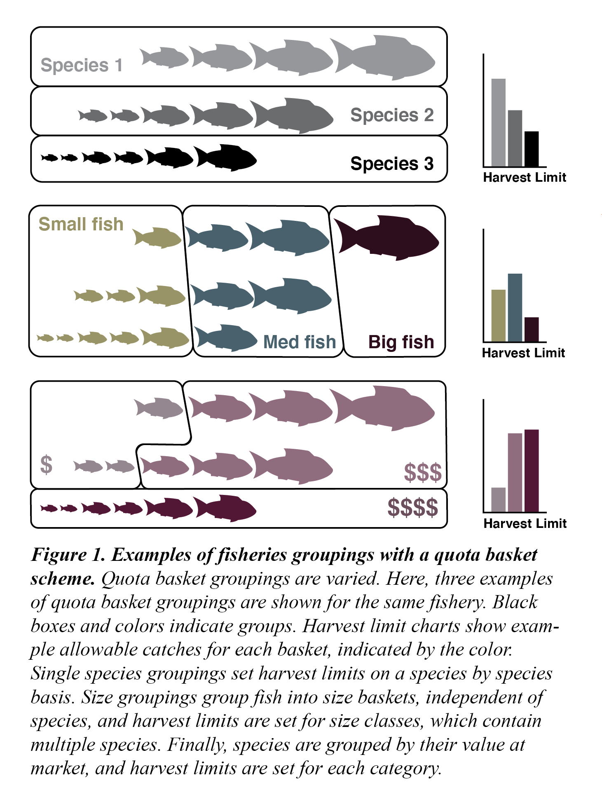
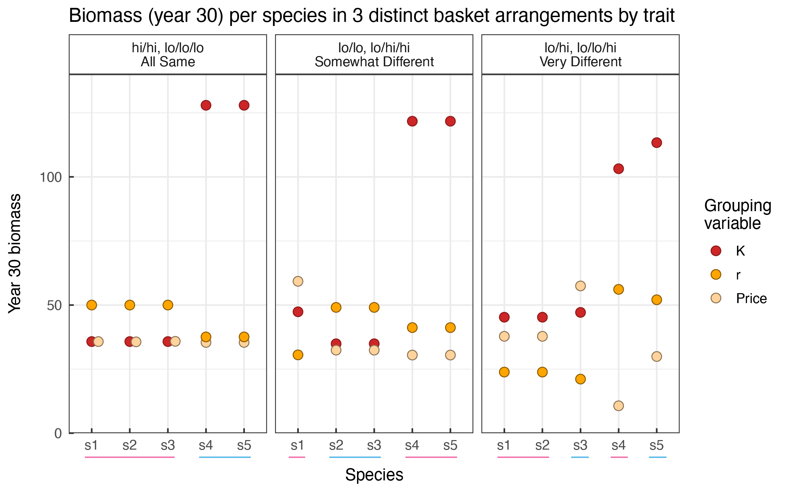
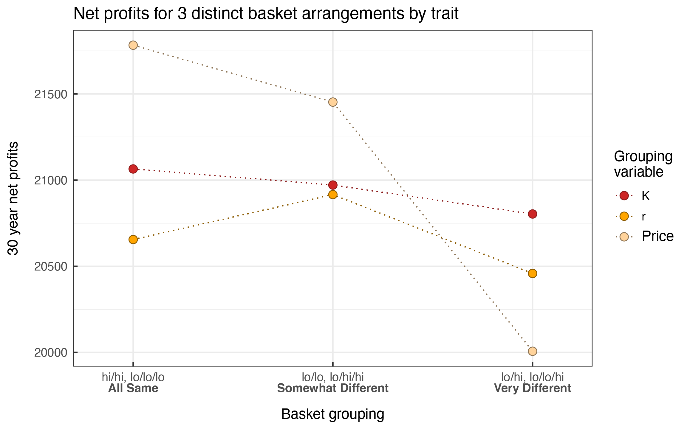
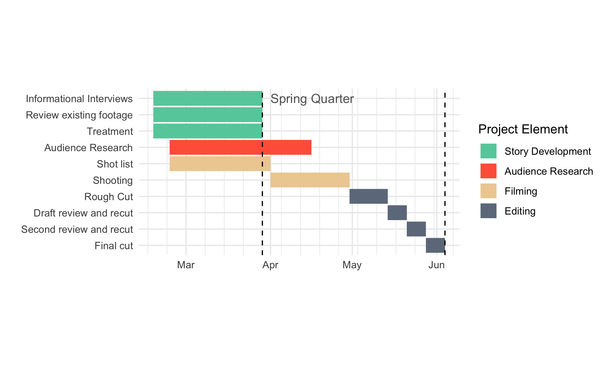
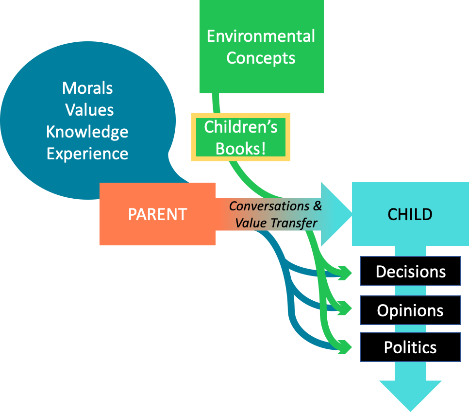
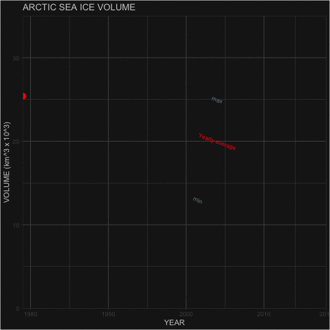
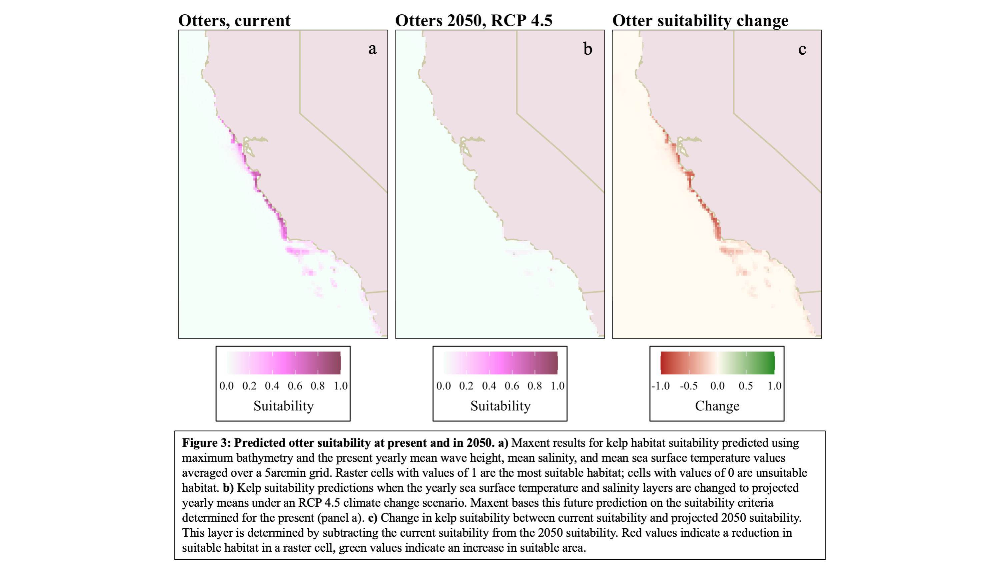

## These are data visualization examples created by Gabriel De La Rosa for various projects, compiled in one place.

### *Schematic of Quota Baskets, a novel approach to fisheries management, created from scratch in Adobe Illustrator*

### *Example figure from the Quota Baskets final report, created in R and finalized in Illustrator*

### *Another Example figure from the Quota Baskets final report, created in R and finalized in Illustrator*

### *Gantt Chart greated in R and Illustrator*

### *Flow chart created in powerpoint*

### *Arctic sea ice volume animated chart, created in R*

### *Spatial extent of otter habitat, 2020 and 2050, created in R*

