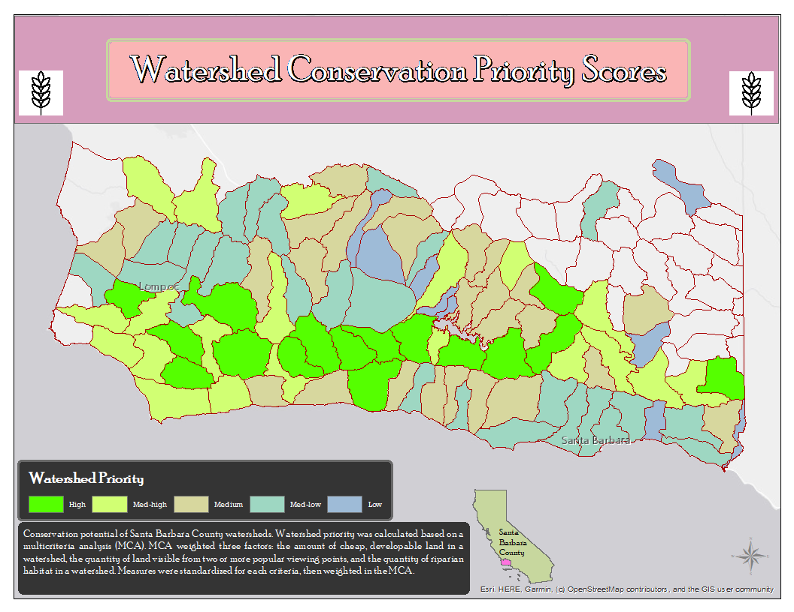

```{r setup, include=FALSE}
knitr::opts_chunk$set(echo = FALSE)
```

## Multicriteria (MCA) analysis to evaluate conservation potential of Santa Barbara County public land

This project aims to rank Santa Barbara watersheds based on conservation potential determined by a multicriteria analyses. The goal is to identify private, cheap land with high conservation value in Santa Barbara county.

Land is ranked based on the following criteria:

* Riparian habitat: land within 1,000 feet of a stream, and with significant vegetation
* Public view: land is more valuable if it can be seen from multiple public viewpoints
* Land cost: is in the lowest quitile of price per area

This multicriteria analysis weights riparian habitat the most important factor (0.50), then viewshed (0.33), and finally land cost (0.17). However, I built a tool in GIS that allows a user to select their own weights for subsequent analysis. 

The data for this project was provided as follows:

- Digital Elevation Model: [USGS, 2009](https://www.usgs.gov/core-science-systems/national-geospatial-program/national-map)
- Lansat 7: [USGS, 2005](https://earthexplorer.usgs.gov/)
- Watersheds: [CalWater, 2004](https://www.mlml.calstate.edu/mpsl-mlml/data-center/data-entry-tools/data-tools/gis-shapefile-layers/)
- Streams: SBGIS, 2002
- Parcels: SBGIS, 2009
- Viewpoints: James Frew, UCSB



