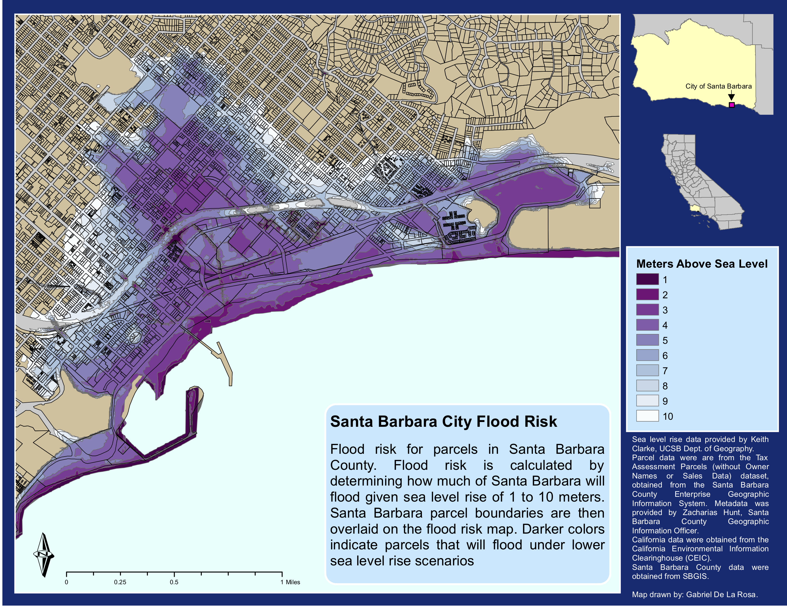

```{r setup, include=FALSE}
knitr::opts_chunk$set(echo = FALSE)
```

## Mapping sea level rise in Santa Barbara County

This project explores the impact of sea level rise in the city of Santa Barbara. I took a digital elevation model and overlaid Santa Barbara parcels, then computed the number of flooded parcels for each meter of sea level rise, up to ten meters (which is a ridiculous height).

Analysis was completed in ArcMap. 

Data is provided by: 

* Digital Elevation Model: Keith Clarke, UCSB Geography
* Parcels, streets, and city data: SBGIS, 2010
* California: CEIC



